# PROJECT REPORT

## 1.4 Project Scope

The project will be implemented as a web-based gaming community platform called "Glyph" using modern web development technologies. The front-end will be built with HTML, CSS, and JavaScript, using Laravel's Blade templating engine to render dynamic content. The back-end will use the Laravel framework (PHP) for business logic and API integration. User accounts and game data will be stored in a MySQL database. Laravel's MVC (Model-View-Controller) structure will manage data flow securely, and the responsive design will ensure the interface is user-friendly on different devices.

The social gaming hub will extract behavioral data from the Steam Web API. Specifically, for each authenticated user, it will retrieve the list of games they own along with playtime statistics, their unlocked achievements, and their current activity status or recently played games. Steam's endpoints will be used to gather this information. The system may also pull friends lists and profile information, subject to user privacy settings, to show mutual connections. This data will be processed and displayed in the user's profile within the hub, enabling in-context access to gaming history and stats. The platform focuses on four major games: Counter-Strike 2 (CS2), Dota 2, Warframe, and Apex Legends, providing specialized features and community tools for these specific gaming communities.

This project will apply multi-factor authentication which combines password and one-time password (OTP) verification for all user accounts. After entering their login credentials, users will receive a 6-digit OTP code via email that must be entered within 10 minutes to complete the authentication process. The OTP system uses cryptographically secure random number generation and includes rate limiting to prevent abuse, allowing only 3 resend attempts per minute and 5 login attempts per minute. The email delivery system is configured with Gmail SMTP using app-specific passwords and TLS encryption to ensure reliable delivery of authentication codes.

The platform implements real-time communication features using Laravel Reverb, a WebSocket server that enables instant messaging within gaming communities. Users can create and join servers (gaming communities) with multiple text channels for organized discussions. The messaging system supports real-time message posting, editing, and deletion with immediate updates across all connected users. Each server operates with an invite-based membership system using unique 8-character invite codes, and includes comprehensive moderation tools such as user banning and muting capabilities for community management.

Advanced gaming features include intelligent team formation and matchmaking systems that analyze user skill levels based on Steam achievements and playtime data. The platform provides smart server recommendations by matching users with communities that align with their gaming preferences and activity patterns. A comprehensive goal and achievement system allows server administrators to create community challenges with progress tracking and milestone rewards. The application includes detailed analytics and insights for both individual users and server administrators, tracking metrics such as gaming activity, team participation, goal completion rates, and community engagement levels.

The technical implementation utilizes Tailwind CSS 4.0 for modern, responsive styling and Vite for efficient asset compilation and hot module replacement during development. Real-time features are powered by Laravel Echo with Pusher.js for WebSocket communication, ensuring smooth and reliable live updates. The database architecture includes optimized indexes for high-performance queries, particularly for messaging, user relationships, and gaming data retrieval. Security measures include comprehensive input validation, CSRF protection, XSS prevention through Blade templating, and SQL injection prevention using Laravel's Eloquent ORM with parameterized queries.

## 1.5 Application Modules

The application is structured into several key modules that handle different aspects of the gaming platform functionality. Each module is designed to manage specific features while maintaining clear separation of concerns and enabling seamless integration between different system components.

**Authentication Module** manages user registration, login, and security features including the OTP verification system. This module handles user account creation with email verification, secure password management, and the two-factor authentication process using 6-digit codes sent via email. It includes rate limiting to prevent abuse and ensures secure session management throughout the user's interaction with the platform.

**Steam Integration Module** handles all interactions with the Steam Web API, including user authentication through Steam OpenID, profile data synchronization, and gaming statistics retrieval. This module manages Steam account linking, fetches user game libraries with playtime data, retrieves achievement information, and monitors current gaming activity status. It includes caching mechanisms to optimize API calls and provides real-time updates of gaming status across the platform.

**Server Management Module** controls the creation and administration of gaming communities (servers) within the platform. This module enables users to create servers with custom settings, manage member permissions through role-based access control, handle server invitations using unique codes, and implement moderation tools such as member banning and muting capabilities. It also manages server discovery and categorization features.

**Communication Module** implements the real-time messaging system using WebSocket technology through Laravel Reverb. This module handles message posting, editing, and deletion within server channels, provides instant message delivery across all connected users, manages channel organization within servers, and ensures proper message history and persistence.

**Team Management Module** facilitates team formation and management for competitive gaming activities. This module allows users to create teams for specific games, manage team membership with role assignments, handle team recruitment processes, and track team performance and statistics. It integrates with the matchmaking system to suggest compatible team members based on skill levels and gaming preferences.

**Matchmaking Module** provides intelligent player matching services based on gaming skills, preferences, and availability. This module analyzes user Steam data to calculate skill scores, matches players with similar skill levels for team formation, handles matchmaking requests and queues, and provides recommendations for compatible teammates across different games.

**Goal and Achievement Module** manages community challenges and competitive features within servers. This module enables server administrators to create community goals and challenges, tracks individual and collective progress toward objectives, manages milestone systems and rewards, and integrates with Steam achievements to create meaningful gaming objectives for community members.

**Profile Management Module** handles user profile creation, editing, and display features including Steam data integration. This module manages user display information, processes and displays gaming statistics from Steam, handles friend relationships and social connections, and provides comprehensive gaming activity tracking and history.

**Server Recommendation Module** provides intelligent server discovery and recommendation services based on user gaming preferences and activity patterns. This module analyzes user Steam gaming data to suggest relevant communities, implements server tagging and categorization systems, processes compatibility scores between users and servers, and delivers personalized server recommendations to enhance user engagement.

**Dashboard Module** serves as the central hub for user interaction and provides an overview of all platform activities. This module displays user's servers, recent messages, friend activities, team information, and ongoing goals while providing quick access to all major platform features through an intuitive interface.

## 1.6 Use Case Diagram

```plantuml
@startuml
' Set diagram direction from left to right for clarity
left to right direction

' Define the parent actor (general user)
actor User

' Define the child actors (specialized users)
actor "Unregistered User" as Unregistered
actor "Registered User" as Registered

' Define the admin actor (specialized from Registered User)
actor "Server Admin" as Admin

' Show the parent-child relationships (Generalization)
' Admin "is a type of" Registered User
Registered <|-- Admin

' Unregistered and Registered "are types of" User
User <|-- Unregistered
User <|-- Registered

' Group use cases within the system boundary
rectangle "Glyph Gaming Platform" {
  
  package "Authentication System" {
    usecase "Register Account" as UC1
    usecase "Login with Email" as UC2
    usecase "Verify OTP" as UC3
    usecase "Resend OTP" as UC4
    usecase "Link Steam Account" as UC5
    usecase "Logout" as UC6
  }
  
  package "Profile Management" {
    usecase "View User Profile" as UC7
    usecase "Edit Profile" as UC8
    usecase "Refresh Steam Data" as UC9
    usecase "View Gaming Statistics" as UC10
  }
  
  package "Friend System" {
    usecase "Search Users" as UC11
    usecase "Send Friend Request" as UC12
    usecase "Accept Friend Request" as UC13
    usecase "Decline Friend Request" as UC14
    usecase "Remove Friend" as UC15
    usecase "View Friends List" as UC16
  }
  
  package "Server Management" {
    usecase "Create Server" as UC17
    usecase "Join Server" as UC18
    usecase "Leave Server" as UC19
    usecase "Discover Servers" as UC20
    usecase "View Server" as UC21
    usecase "Delete Server" as UC22
  }
  
  package "Server Administration" {
    usecase "Manage Server Settings" as UC23
    usecase "Create Channel" as UC24
    usecase "Edit Channel" as UC25
    usecase "Delete Channel" as UC26
    usecase "Create Role" as UC27
    usecase "Edit Role" as UC28
    usecase "Delete Role" as UC29
    usecase "Assign Role" as UC30
    usecase "Kick Member" as UC31
    usecase "Ban Member" as UC32
    usecase "Unban Member" as UC33
    usecase "Mute Member" as UC34
    usecase "Unmute Member" as UC35
  }
  
  package "Communication" {
    usecase "Send Message" as UC36
    usecase "Edit Message" as UC37
    usecase "Delete Message" as UC38
    usecase "View Channel Messages" as UC39
    usecase "Receive Real-time Updates" as UC40
  }
  
  package "Matchmaking" {
    usecase "Create Matchmaking Request" as UC41
    usecase "Find Teammates" as UC42
    usecase "View Matchmaking Queue" as UC43
    usecase "Cancel Matchmaking Request" as UC44
  }
  
  package "Goals & Achievements" {
    usecase "Create Server Goal" as UC45
    usecase "Join Goal" as UC46
    usecase "Leave Goal" as UC47
    usecase "View Goal Progress" as UC48
    usecase "Complete Goal" as UC49
    usecase "View Leaderboards" as UC50
  }
  
  package "Recommendations" {
    usecase "Get Server Recommendations" as UC51
    usecase "View Server Compatibility" as UC52
  }
  
  package "Dashboard" {
    usecase "View Dashboard" as UC53
    usecase "View Server Analytics" as UC54
    usecase "Track Gaming Activity" as UC55
  }
}

' Use cases for Unregistered User
Unregistered --> UC1
Unregistered --> UC2

' Use cases for Registered User
' (Admin inherits these automatically)
Registered --> UC2
Registered --> UC3
Registered --> UC4
Registered --> UC5
Registered --> UC6
Registered --> UC7
Registered --> UC8
Registered --> UC9
Registered --> UC10
Registered --> UC11
Registered --> UC12
Registered --> UC13
Registered --> UC14
Registered --> UC15
Registered --> UC16
Registered --> UC17
Registered --> UC18
Registered --> UC19
Registered --> UC20
Registered --> UC21
Registered --> UC36
Registered --> UC37
Registered --> UC38
Registered --> UC39
Registered --> UC40
Registered --> UC41
Registered --> UC42
Registered --> UC43
Registered --> UC44
Registered --> UC46
Registered --> UC47
Registered --> UC48
Registered --> UC50
Registered --> UC51
Registered --> UC52
Registered --> UC53
Registered --> UC55

' Use cases specific to Server Admin
Admin --> UC22
Admin --> UC23
Admin --> UC24
Admin --> UC25
Admin --> UC26
Admin --> UC27
Admin --> UC28
Admin --> UC29
Admin --> UC30
Admin --> UC31
Admin --> UC32
Admin --> UC33
Admin --> UC34
Admin --> UC35
Admin --> UC45
Admin --> UC49
Admin --> UC54

' Include relationships
UC2 ..> UC3 : <<include>>
UC17 ..> UC24 : <<include>>
UC41 ..> UC42 : <<include>>
UC45 ..> UC46 : <<include>>

' Extend relationships
UC3 ..> UC4 : <<extend>>
UC36 ..> UC40 : <<extend>>
UC37 ..> UC40 : <<extend>>
UC38 ..> UC40 : <<extend>>

@enduml
```

## 1.7 Use Case Diagram Explanation

The use case diagram illustrates the comprehensive functionality and actor interactions within the Glyph gaming platform through a hierarchical actor structure and 55 distinct use cases organized into 9 functional packages. The diagram demonstrates a multi-level generalization structure where User serves as the parent actor, with Unregistered User and Registered User inheriting from User, and Server Admin further specializing from Registered User to handle administrative responsibilities when managing gaming communities.

The actor hierarchy begins with the general User actor, which represents any individual interacting with the platform. Unregistered Users are specialized actors who can only perform basic authentication actions including account registration and login attempts, representing visitors who have not yet completed the full registration process. Registered Users inherit all capabilities from the base User actor and gain access to the majority of platform features including profile management, social interactions, server participation, communication, and gaming activities. Server Admins represent the highest specialization level, inheriting all Registered User capabilities while gaining additional administrative privileges for managing gaming communities, including server deletion, comprehensive moderation tools, goal creation, and analytics access.

The Authentication System package contains six fundamental use cases that control platform access and security. Unregistered Users can register new accounts and attempt login, while the system enforces a secure multi-factor authentication process through email-based OTP verification. The login process includes OTP verification as a mandatory step, demonstrated through an include relationship, ensuring that all authentication attempts must complete the two-factor verification process. The OTP verification extends to include an optional resend functionality for cases where users do not receive their initial verification code. Registered Users can additionally link their Steam accounts for enhanced gaming integration and logout to terminate their sessions securely.

Profile Management encompasses four use cases that handle user information display and gaming data integration. Registered Users can view both their own and other users' profiles, edit their personal information and preferences, refresh Steam data to synchronize the latest gaming statistics and achievements, and view comprehensive gaming analytics including playtime data, achievement progress, and gaming preferences. This package demonstrates the platform's integration with external gaming services to provide rich user profiles that enhance the gaming community experience.

The Friend System package facilitates social networking through six use cases that enable users to build gaming connections. All Registered Users can search for other platform users, send friend requests to establish connections, accept or decline incoming friend requests based on their preferences, remove existing friends when relationships change, and view their complete friends list to stay connected with their gaming network. This social foundation supports the community-building aspect of the gaming platform by enabling users to find and maintain relationships with like-minded gamers.

Server Management controls the core community features through six use cases that govern gaming server creation and participation. Registered Users can create new gaming servers to establish communities around specific games or interests, join existing servers using invite codes or discovery mechanisms, leave servers when they no longer wish to participate, discover new servers through intelligent recommendation systems, and view server content including channels and member information. Server Admins possess the additional capability to delete servers they manage, providing complete lifecycle control over their gaming communities. The create server use case includes automatic channel creation, ensuring that new servers have basic communication infrastructure from the moment of creation.

Server Administration provides the most comprehensive management capabilities through thirteen use cases exclusively available to Server Admins. These administrative functions include managing overall server settings and configurations, creating new communication channels for organized discussions, editing existing channel properties and permissions, deleting channels that are no longer needed, creating custom roles with specific permission sets, editing role properties and hierarchies, deleting obsolete roles, assigning roles to server members to establish permission structures, and implementing comprehensive member moderation tools. The moderation capabilities include kicking disruptive members for temporary removal, banning problematic users with permanent restrictions, unbanning previously banned members when appropriate, muting members to restrict their communication privileges, and unmuting members to restore their communication rights.

The Communication package implements real-time messaging functionality through five use cases that enable seamless interaction within gaming communities. All Registered Users can send messages within server channels, edit their own messages to correct mistakes or update information, delete their own messages when necessary, view complete channel message histories for context and continuity, and receive real-time updates through WebSocket technology for immediate message synchronization. The real-time update functionality extends the basic messaging operations of sending, editing, and deleting messages, ensuring that all connected users see changes instantaneously without manual refresh requirements.

Matchmaking services are provided through four use cases that facilitate intelligent player connections based on gaming preferences and skill levels. Registered Users can create matchmaking requests specifying their game preferences, skill requirements, and team formation needs, find compatible teammates through algorithmic analysis of Steam data and gaming preferences, view active matchmaking queues to see available opportunities and wait times, and cancel their matchmaking requests when their needs change or they find alternative arrangements. The matchmaking request creation includes automatic teammate finding functionality, ensuring that users receive immediate suggestions when creating new requests.

The Goals and Achievements package enables community engagement through six use cases that create competitive and collaborative experiences within gaming servers. Server Admins can create community goals and challenges that encourage member participation and engagement, while Registered Users can join these goals to participate in collective achievements, leave goals when their interests change, view detailed progress tracking for both individual and community advancement, and view competitive leaderboards that showcase top performers and achievement leaders. Server Admins maintain the exclusive capability to complete goals when objectives are met, providing proper closure and recognition for community achievements. The goal creation process includes automatic participant joining functionality for the goal creator, ensuring immediate engagement.

The Recommendations package offers personalized server discovery through two use cases that enhance user experience and community growth. All Registered Users can receive intelligent server recommendations based on their Steam gaming data, playtime statistics, and gaming preferences, and view detailed server compatibility scores that explain why specific communities might align with their interests and gaming patterns. This recommendation system leverages Steam integration to provide meaningful suggestions that increase the likelihood of successful community matches.

Finally, the Dashboard package serves as the central information hub through three use cases that provide comprehensive platform overview and analytics. All Registered Users can view their personalized dashboard displaying server memberships, recent activities, friend updates, and gaming statistics, and track their gaming activity across different games and communities to monitor their engagement patterns. Server Admins gain access to detailed server analytics that provide insights into community health, member engagement, popular activities, and growth patterns, enabling data-driven decisions for community management and improvement.

The relationships within the diagram include several include dependencies where certain use cases automatically trigger others, such as login requiring OTP verification, server creation including channel creation, matchmaking requests including teammate finding, and goal creation including participant joining. Extend relationships demonstrate optional enhancements, particularly the OTP resend functionality that extends verification when needed, and real-time updates that extend all messaging operations to provide immediate synchronization. The generalization relationships clearly show the inheritance hierarchy where Server Admins inherit all Registered User capabilities while adding administrative functions, and both Unregistered and Registered Users inherit from the base User actor, creating a logical and scalable permission structure that supports the platform's community-focused gaming environment.

## 1.8 Activity Diagrams

### 1.8.1 User Registration Flow

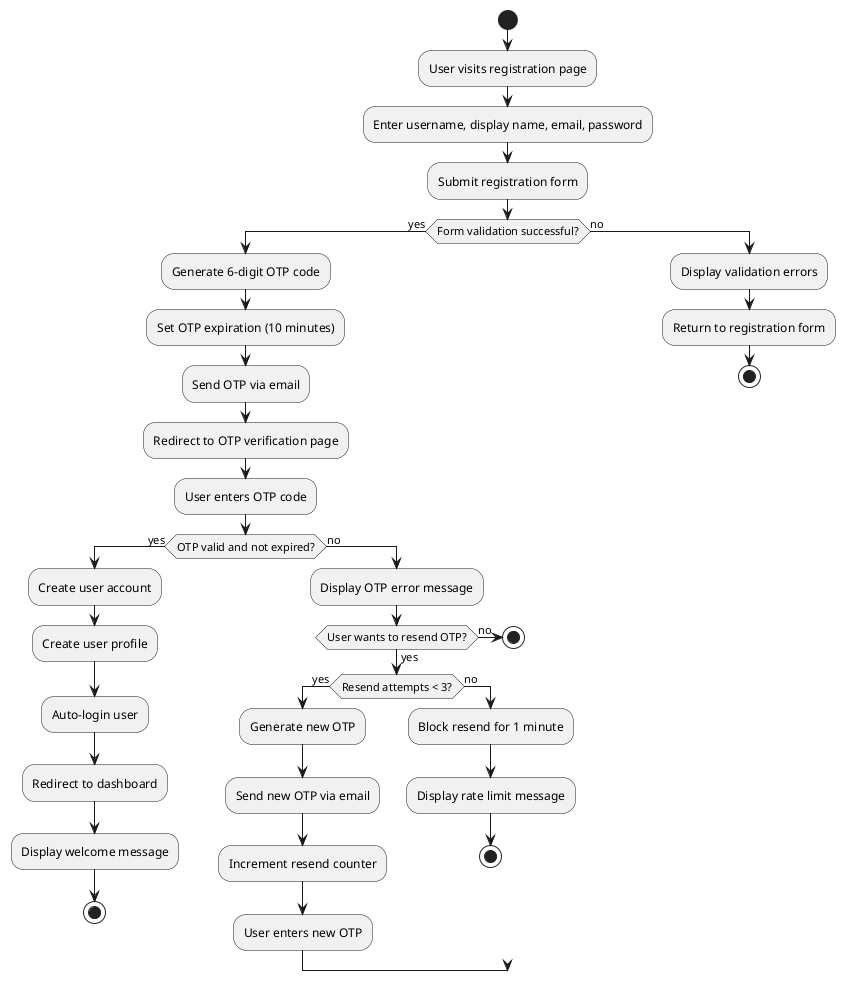

The user registration flow demonstrates the comprehensive account creation process with built-in security measures and user experience considerations. The process begins when an unregistered user accesses the registration page and provides essential information including username, display name, email address, and password. The system performs thorough form validation to ensure all required fields are completed correctly and that the email format is valid before proceeding to the next step.

Upon successful form validation, the system implements a secure two-factor authentication mechanism by generating a cryptographically secure 6-digit OTP code with a 10-minute expiration window. The OTP is immediately sent to the user's provided email address using the configured Gmail SMTP service, and the user is redirected to a verification page where they must enter the received code. If the OTP verification succeeds, the system creates the user account with all provided information, establishes a corresponding user profile for gaming data storage, automatically logs in the new user, and redirects them to the dashboard with a welcome message. The flow includes error handling for invalid OTP codes and implements rate limiting for OTP resend requests, allowing up to 3 resend attempts before imposing a 1-minute cooldown period to prevent abuse while maintaining system security.

### 1.8.2 User Login Flow

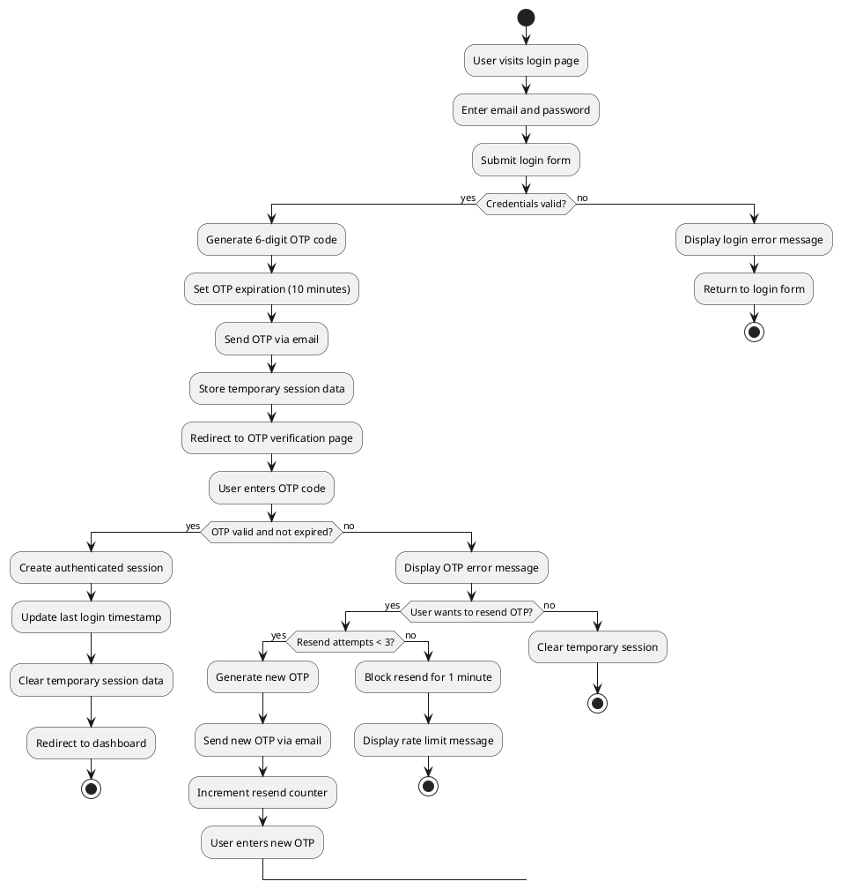

The user login flow implements a secure two-factor authentication system that ensures account security while maintaining user convenience. The process initiates when a user accesses the login page and submits their email address and password credentials. The system validates these credentials against the database, and upon successful verification, generates a new 6-digit OTP code with a 10-minute expiration period and sends it to the user's registered email address via the configured SMTP service.

During the OTP verification phase, the system maintains temporary session data to track the authentication state while the user completes the verification process. Once the user enters the correct OTP code within the expiration window, the system establishes a fully authenticated session, updates the user's last login timestamp for security auditing purposes, clears any temporary session data, and redirects the user to their personalized dashboard. The flow incorporates comprehensive error handling for both invalid credentials and OTP verification failures, includes the same rate limiting mechanism as registration for OTP resend requests, and ensures that incomplete authentication attempts are properly cleaned up to maintain system security and prevent session hijacking attempts.

### 1.8.3 Steam Account Linking Flow

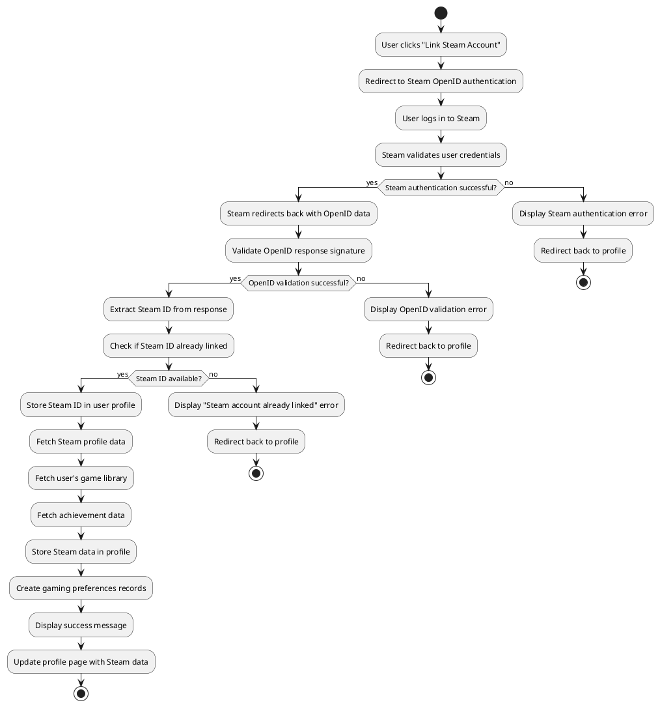

The Steam account linking flow facilitates seamless integration between user profiles and their Steam gaming accounts through a secure OpenID authentication process. The flow begins when an authenticated user chooses to link their Steam account from their profile settings, triggering a redirect to Steam's OpenID authentication service where they must log in using their Steam credentials. Steam validates the user's credentials and, upon successful authentication, redirects back to the Glyph platform with encrypted OpenID data containing the user's Steam identification information.

The system performs thorough validation of the OpenID response signature to ensure authenticity and prevent tampering, then extracts the unique Steam ID from the authenticated response. Before storing the Steam ID, the system checks whether this particular Steam account is already linked to another user profile to prevent duplicate associations. Once validated, the system stores the Steam ID in the user's profile and immediately begins fetching comprehensive gaming data including Steam profile information, complete game library with playtime statistics, achievement data, and currently playing status. This information is processed and stored in the user's profile, automatically creating gaming preference records for recommendation algorithms, and the user receives confirmation of successful linking with their profile page updated to display their Steam gaming information, enabling enhanced community matching and personalized server recommendations.

### 1.8.4 Server Creation Flow

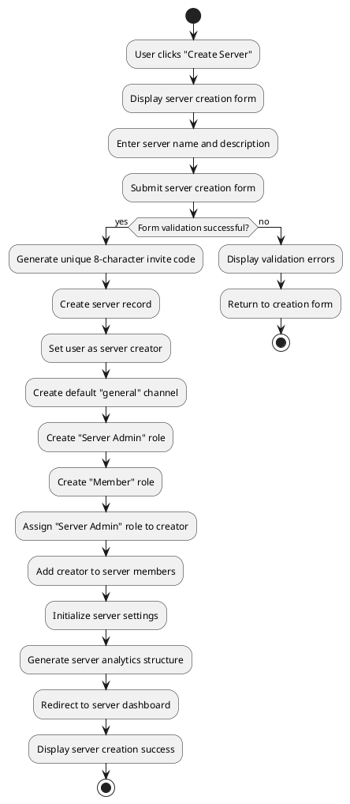

The server creation flow enables registered users to establish new gaming communities with comprehensive initialization and proper role structure setup. The process begins when a user accesses the server creation interface and completes a form specifying the server name and optional description that will define the community's identity and purpose. Upon form submission, the system validates the input to ensure the server name meets requirements and the description falls within acceptable length limits.

Following successful validation, the system automatically generates a unique 8-character alphanumeric invite code for the server, creates the server record in the database with the user designated as the creator, and initializes the essential community infrastructure. This includes creating a default "general" channel for immediate communication, establishing a hierarchical role system with "Server Admin" and "Member" roles, automatically assigning the "Server Admin" role to the creator for full management privileges, adding the creator to the server membership, configuring default server settings, and setting up the analytics framework for future community insights. The user is then redirected to the newly created server's dashboard where they can begin customizing channels, roles, and settings while receiving confirmation of successful server creation, enabling them to immediately start building their gaming community.

### 1.8.5 Server Joining Flow

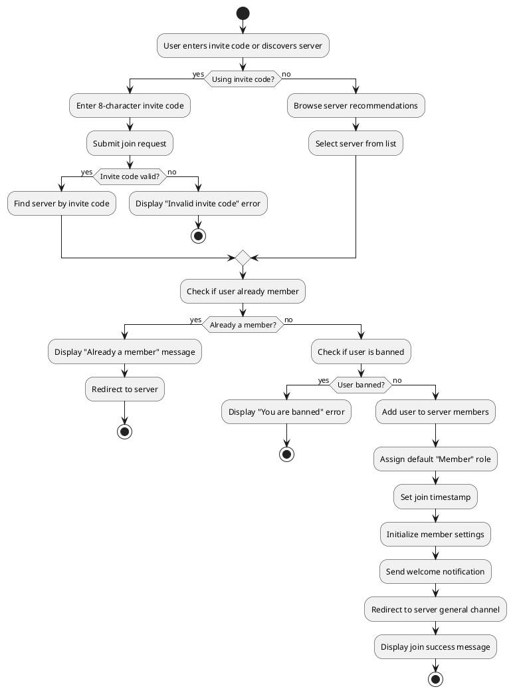

The server joining flow provides multiple pathways for users to discover and join gaming communities while implementing appropriate access controls and member management. Users can join servers through two primary methods: entering an 8-character invite code directly or discovering servers through the platform's recommendation system that suggests communities based on their gaming preferences and Steam data. When using an invite code, the system validates the code format and existence, while the discovery method allows users to browse curated server recommendations and select communities that align with their interests.

Before adding a user to any server, the system performs essential membership checks to ensure a smooth joining experience and maintain community integrity. The system verifies whether the user is already a member to prevent duplicate memberships, checks for any existing ban status that would prevent access, and only proceeds with the joining process if both conditions are clear. Upon successful validation, the system adds the user to the server's member list, assigns the default "Member" role for basic permissions, records the join timestamp for analytics purposes, initializes member-specific settings and preferences, sends a welcome notification to help orient the new member, and redirects them to the server's general channel where they can immediately begin participating in community discussions and activities.

### 1.8.6 Real-time Messaging Flow

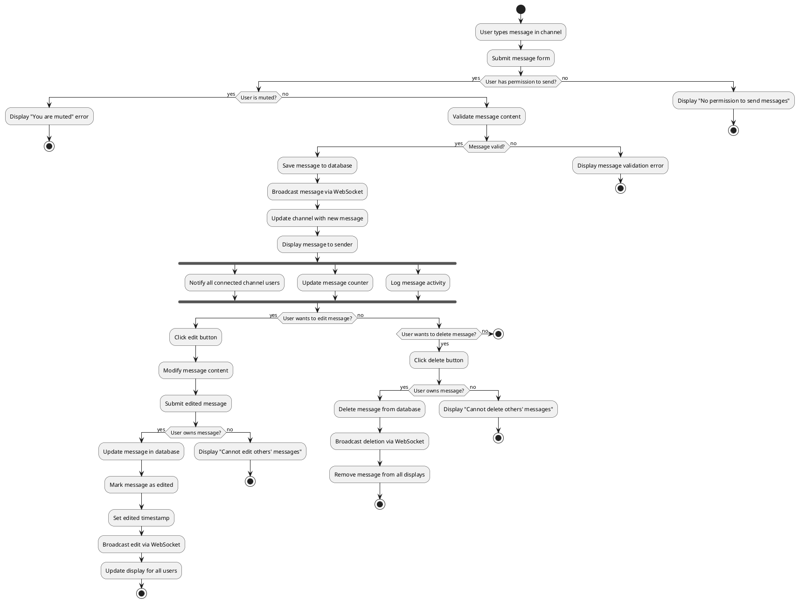

The real-time messaging flow demonstrates the platform's sophisticated communication system that enables instant message delivery with comprehensive permission controls and real-time synchronization across all connected users. The process begins when a user types a message in a server channel and submits it through the messaging interface, triggering immediate permission verification to ensure the user has appropriate access rights and is not currently muted by server administrators. Upon passing these security checks, the system validates the message content for appropriate length and format requirements.

Once validated, the message is permanently stored in the database with full metadata including timestamps, user identification, and channel association, then immediately broadcast to all connected users through WebSocket technology for real-time delivery. The system employs parallel processing to simultaneously notify all channel participants, update activity counters for analytics purposes, and log the message activity for moderation and audit trails. The messaging system supports comprehensive message management capabilities, allowing users to edit their own messages with automatic "edited" indicators and timestamps, delete their own messages with immediate removal from all user displays, while maintaining strict ownership controls that prevent users from modifying or deleting messages created by others, ensuring message integrity and proper communication flow within gaming communities.

### 1.8.7 Server Administration Flow

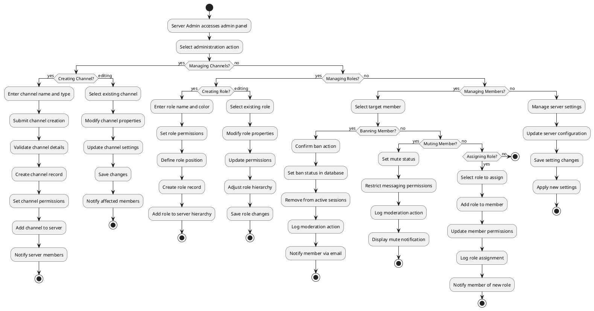

The server administration flow provides comprehensive management capabilities for Server Admins to maintain and customize their gaming communities through multiple administrative functions. The flow begins when a Server Admin accesses the administration panel and selects from various management categories including channel administration, role management, member moderation, and general server settings. For channel management, admins can create new channels by specifying names and types (text or voice), edit existing channel properties including permissions and descriptions, or delete channels that are no longer needed, with all changes immediately reflected across the server and automatically notifying relevant members.

Role management enables admins to establish hierarchical permission structures by creating custom roles with specific names, colors, and permission sets, positioning roles within the server hierarchy to determine authority levels, and editing existing roles to adjust permissions or visual properties as community needs evolve. Member moderation provides powerful tools for maintaining community standards through banning disruptive members with automatic session termination and email notifications, muting members to temporarily restrict their communication privileges while maintaining their server access, assigning or removing roles to adjust individual member permissions and responsibilities, and logging all moderation actions for accountability and audit purposes. The administration system ensures that all changes are immediately applied, properly logged for transparency, and communicated to affected members through appropriate notification channels, enabling admins to maintain healthy and well-organized gaming communities.

### 1.8.8 Matchmaking Request Flow

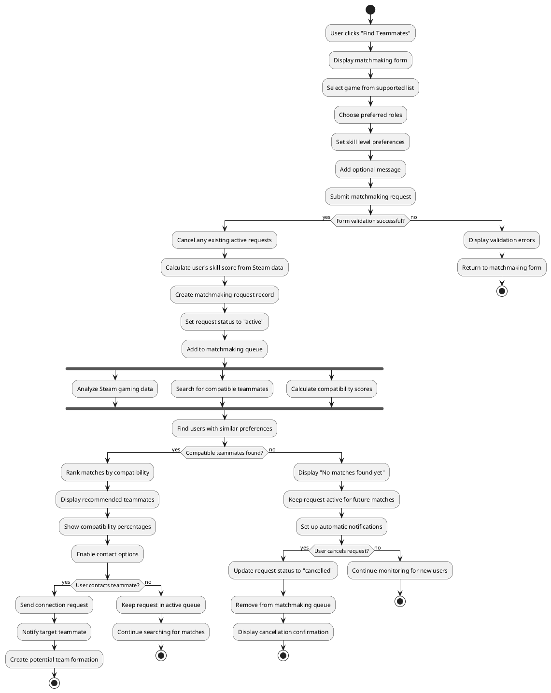

The matchmaking request flow implements an intelligent teammate discovery system that leverages Steam gaming data and user preferences to facilitate optimal team formation for competitive gaming. The process begins when a user accesses the matchmaking interface and completes a detailed form specifying their preferred game from the supported list (CS2, Dota 2, Warframe, Apex Legends), desired roles within the game, skill level preferences for potential teammates, and an optional message describing their gaming style or specific requirements. The system validates this information and automatically cancels any existing active matchmaking requests to prevent conflicts.

Upon successful form submission, the system calculates the user's skill score based on their Steam achievement data and playtime statistics, creates an active matchmaking request record, and adds it to the matchmaking queue for processing. The system employs sophisticated algorithms to analyze the user's Steam gaming data, search for compatible teammates with similar skill levels and game preferences, and calculate compatibility scores based on multiple factors including playtime, achievements, preferred roles, and gaming schedules. When compatible teammates are identified, the system ranks them by compatibility percentage and presents recommendations with detailed compatibility explanations, enabling users to initiate contact through the platform's communication system. If no immediate matches are found, the request remains active in the queue with automatic notifications enabled for future compatible users, while providing options for users to cancel their requests or modify their preferences as their needs change.

### 1.8.9 Server Goal Creation and Participation Flow

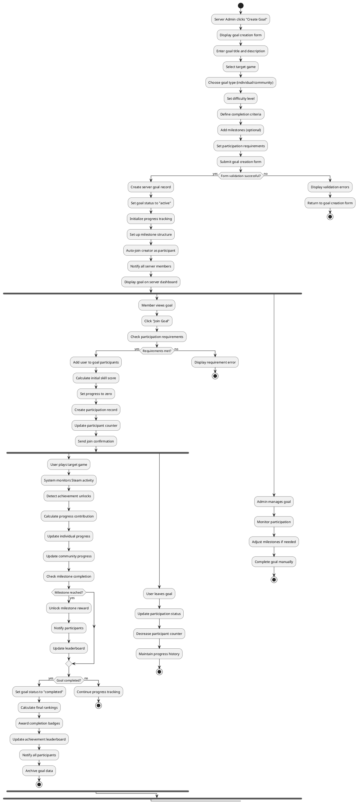

The server goal creation and participation flow demonstrates the platform's comprehensive community engagement system that enables Server Admins to create meaningful challenges while providing automated progress tracking and community interaction. The process begins when a Server Admin accesses the goal creation interface and specifies detailed challenge parameters including the goal title and description, target game from the supported list, goal type (individual achievements or community-wide objectives), difficulty level for appropriate skill matching, specific completion criteria that define success, optional milestone breakdowns for incremental progress, and participation requirements that determine eligibility for joining the challenge.

Upon successful goal creation, the system establishes a complete tracking infrastructure with the goal marked as active, progress monitoring systems initialized, milestone structures configured for incremental rewards, the creator automatically enrolled as the first participant, and all server members notified of the new community challenge. When members choose to join the goal, the system validates their eligibility against the specified requirements, creates participant records with initial skill scores calculated from Steam data, and begins monitoring their gaming activity through Steam API integration. The system automatically detects relevant achievements, calculates progress contributions toward individual and community objectives, manages milestone completions with appropriate rewards and notifications, maintains dynamic leaderboards for competitive engagement, and provides comprehensive participation management including the ability to leave goals while preserving progress history. Server Admins retain full control over goal management with capabilities to monitor participation rates, adjust milestones based on community response, and manually complete goals when objectives are achieved, ensuring that community challenges remain engaging and appropriately calibrated for their gaming communities.

### 1.8.10 Profile Management and Steam Data Refresh Flow

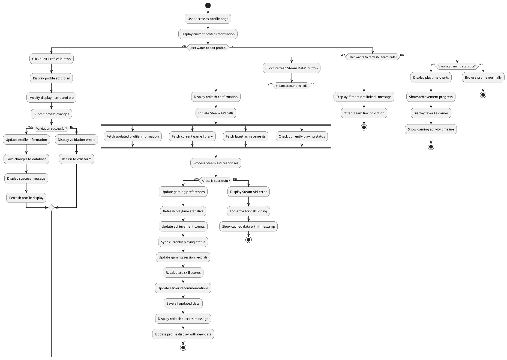

The profile management and Steam data refresh flow provides comprehensive user profile control with real-time gaming data synchronization capabilities. The flow begins when a user accesses their profile page, displaying current profile information including personal details, gaming statistics, and Steam integration status. Users can edit their profile information by modifying their display name and biographical information through a dedicated edit form with validation to ensure appropriate content and format requirements, with all changes immediately saved and reflected in the profile display upon successful submission.

The Steam data refresh functionality enables users to synchronize their gaming information with the latest data from their Steam accounts through a comprehensive API integration process. When initiated, the system performs parallel API calls to fetch updated profile information, current game library with playtime statistics, latest achievement data, and real-time gaming status, then processes these responses to update gaming preferences, refresh playtime statistics, sync achievement counts, update currently playing status, maintain gaming session records, recalculate skill scores for matchmaking purposes, and update server recommendations based on the refreshed gaming data. The profile system also provides detailed gaming statistics visualization including playtime charts, achievement progress tracking, favorite games analysis, and gaming activity timelines, enabling users to monitor their gaming patterns and share their achievements with the gaming community while maintaining up-to-date information for optimal matchmaking and server recommendation algorithms.

### 1.8.11 Friend Management Flow

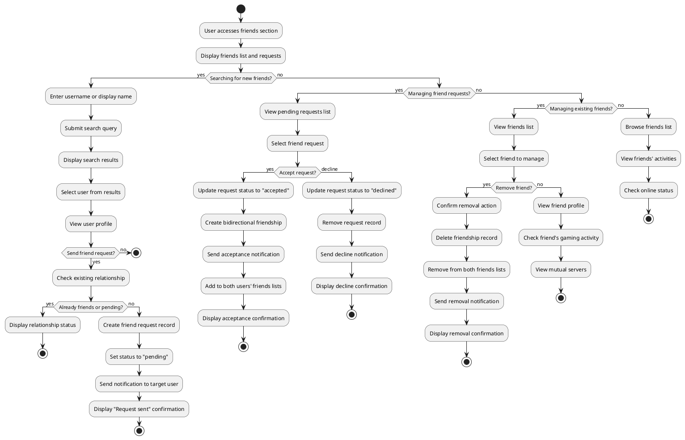

The friend management flow facilitates comprehensive social networking capabilities that enable users to discover, connect with, and maintain relationships with other gamers within the platform. The process begins when a user accesses the friends section, displaying their current friends list, pending friend requests, and available management options. Users can search for new friends by entering usernames or display names, browsing search results to find compatible gamers, viewing profiles to assess gaming compatibility through shared interests and game preferences, and sending friend requests that create pending relationship records with appropriate notifications to target users, while the system prevents duplicate requests and maintains relationship status integrity.

Friend request management provides streamlined approval processes where users can view all pending incoming requests, accept requests to establish bidirectional friendships with automatic addition to both users' friends lists and confirmation notifications, or decline requests with appropriate cleanup and notification handling. Existing friendship management enables users to view their complete friends list with online status indicators, access friends' profiles to check current gaming activities and mutual server memberships, and remove friendships when relationships change, with all actions properly logged and both parties notified of status changes. The friend system enhances the gaming experience by providing easy access to gaming partners, enabling quick identification of friends' current activities and server locations, and supporting the social foundation necessary for effective team formation and community engagement within the gaming platform.

### 1.8.12 Server Discovery and Recommendation Flow

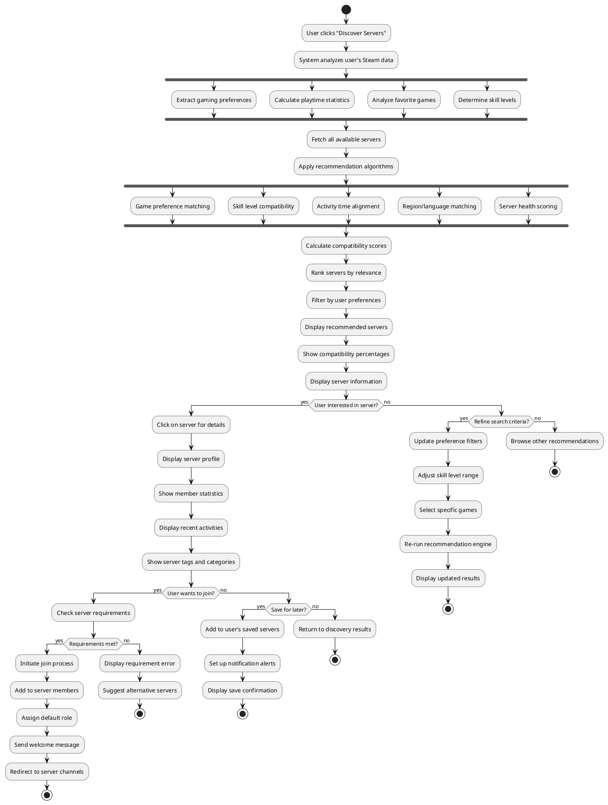

The server discovery and recommendation flow implements an intelligent community matching system that leverages comprehensive user gaming data to suggest optimal server communities. The process begins when a user accesses the server discovery interface, triggering sophisticated analysis of their Steam gaming data including extraction of gaming preferences based on playtime distribution, calculation of detailed playtime statistics across different games, identification of favorite games through engagement patterns, and determination of skill levels through achievement analysis and gaming performance metrics. The system simultaneously fetches all available public servers and applies multi-faceted recommendation algorithms that evaluate game preference alignment, skill level compatibility between the user and existing server members, activity time synchronization for optimal engagement opportunities, region and language matching for communication effectiveness, and server health scoring based on member activity and community engagement.

Following comprehensive analysis, the system calculates detailed compatibility scores for each potential server match, ranks servers by relevance and compatibility percentage, applies user-specified preference filters for personalized results, and displays recommended servers with clear compatibility indicators and detailed server information including member statistics, recent community activities, and descriptive tags. Users can explore server details through dedicated profiles that showcase community health metrics, member demographics, and activity patterns, then choose to join servers immediately if requirements are met, save interesting servers for future consideration with notification alerts for community updates, or refine their search criteria to discover alternative communities. The recommendation system continuously learns from user interactions and preferences, improving future suggestions and ensuring that users discover gaming communities that align with their interests, skill levels, and social gaming preferences, ultimately enhancing community engagement and user satisfaction within the platform.

## 1.9 Entity Relationship Diagram (ERD)

```plantuml
@startuml
!theme cerulean-outline
skinparam backgroundColor #FAFAFA
skinparam entity {
  BackgroundColor #E8F4FD
  BorderColor #1E88E5
  FontColor #1565C0
  AttributeFontColor #424242
}
skinparam class {
  BackgroundColor #E8F4FD
  BorderColor #1E88E5
  FontColor #1565C0
  AttributeFontColor #424242
  HeaderBackgroundColor #BBDEFB
}
skinparam note {
  BackgroundColor #FFF3E0
  BorderColor #FF9800
  FontColor #E65100
}

entity "users" {
  * id : BIGINT <<PK>>
  --
  * username : VARCHAR(255) <<UNIQUE>>
  * display_name : VARCHAR(255)
  * email : VARCHAR(255) <<UNIQUE>>
  * password : VARCHAR(255)
  steam_id : VARCHAR(255) <<UNIQUE>>
  otp_code : VARCHAR(6)
  otp_expires_at : TIMESTAMP
  email_verified_at : TIMESTAMP
  remember_token : VARCHAR(100)
  * created_at : TIMESTAMP
  * updated_at : TIMESTAMP
}

entity "profiles" {
  * id : BIGINT <<PK>>
  --
  * user_id : BIGINT <<FK>>
  avatar_url : VARCHAR(255)
  bio : TEXT
  status : VARCHAR(50)
  steam_data : JSON
  * created_at : TIMESTAMP
  * updated_at : TIMESTAMP
}

entity "friends" {
  * id : BIGINT <<PK>>
  --
  * user_id : BIGINT <<FK>>
  * friend_id : BIGINT <<FK>>
  * status : ENUM('pending', 'accepted', 'declined')
  * created_at : TIMESTAMP
  * updated_at : TIMESTAMP
}

entity "servers" {
  * id : BIGINT <<PK>>
  --
  * name : VARCHAR(255)
  description : TEXT
  * invite_code : VARCHAR(8) <<UNIQUE>>
  icon_url : VARCHAR(255)
  * creator_id : BIGINT <<FK>>
  * created_at : TIMESTAMP
  * updated_at : TIMESTAMP
}

entity "server_members" {
  * id : BIGINT <<PK>>
  --
  * server_id : BIGINT <<FK>>
  * user_id : BIGINT <<FK>>
  joined_at : TIMESTAMP
  * is_banned : BOOLEAN DEFAULT FALSE
  * is_muted : BOOLEAN DEFAULT FALSE
  * created_at : TIMESTAMP
  * updated_at : TIMESTAMP
}

entity "channels" {
  * id : BIGINT <<PK>>
  --
  * server_id : BIGINT <<FK>>
  * name : VARCHAR(255)
  * type : ENUM('text', 'voice') DEFAULT 'text'
  position : INTEGER DEFAULT 0
  * created_at : TIMESTAMP
  * updated_at : TIMESTAMP
}

entity "messages" {
  * id : BIGINT <<PK>>
  --
  * channel_id : BIGINT <<FK>>
  * user_id : BIGINT <<FK>>
  * content : TEXT
  * is_edited : BOOLEAN DEFAULT FALSE
  edited_at : TIMESTAMP
  * created_at : TIMESTAMP
  * updated_at : TIMESTAMP
}

entity "roles" {
  * id : BIGINT <<PK>>
  --
  * server_id : BIGINT <<FK>>
  * name : VARCHAR(255)
  color : VARCHAR(7)
  permissions : JSON
  * position : INTEGER DEFAULT 0
  * created_at : TIMESTAMP
  * updated_at : TIMESTAMP
}

entity "user_roles" {
  * id : BIGINT <<PK>>
  --
  * user_id : BIGINT <<FK>>
  * role_id : BIGINT <<FK>>
  * server_id : BIGINT <<FK>>
  * created_at : TIMESTAMP
  * updated_at : TIMESTAMP
}

entity "server_tags" {
  * id : BIGINT <<PK>>
  --
  * server_id : BIGINT <<FK>>
  * tag_type : ENUM('game', 'skill_level', 'region', 'language', 'activity_time')
  * tag_value : VARCHAR(255)
  weight : INTEGER DEFAULT 1
  * created_at : TIMESTAMP
  * updated_at : TIMESTAMP
}

entity "user_gaming_preferences" {
  * id : BIGINT <<PK>>
  --
  * user_id : BIGINT <<FK>>
  * game_appid : VARCHAR(255)
  * game_name : VARCHAR(255)
  playtime_forever : INTEGER DEFAULT 0
  playtime_2weeks : INTEGER DEFAULT 0
  last_played : TIMESTAMP
  * created_at : TIMESTAMP
  * updated_at : TIMESTAMP
}

entity "gaming_sessions" {
  * id : BIGINT <<PK>>
  --
  * user_id : BIGINT <<FK>>
  * game_appid : VARCHAR(255)
  * game_name : VARCHAR(255)
  started_at : TIMESTAMP
  ended_at : TIMESTAMP
  duration_minutes : INTEGER
  * status : ENUM('active', 'completed')
  session_data : JSON
  * created_at : TIMESTAMP
  * updated_at : TIMESTAMP
}

entity "teams" {
  * id : BIGINT <<PK>>
  --
  * server_id : BIGINT <<FK>>
  * creator_id : BIGINT <<FK>>
  * name : VARCHAR(255)
  description : TEXT
  * game_appid : VARCHAR(255)
  * game_name : VARCHAR(255)
  * max_size : INTEGER DEFAULT 5
  * current_size : INTEGER DEFAULT 1
  * status : ENUM('recruiting', 'full', 'active', 'disbanded')
  skill_requirements : JSON
  * created_at : TIMESTAMP
  * updated_at : TIMESTAMP
}

entity "team_members" {
  * id : BIGINT <<PK>>
  --
  * team_id : BIGINT <<FK>>
  * user_id : BIGINT <<FK>>
  * role : ENUM('leader', 'co_leader', 'member')
  game_role : VARCHAR(255)
  skill_level : VARCHAR(50)
  individual_skill_score : INTEGER
  joined_at : TIMESTAMP
  left_at : TIMESTAMP
  * status : ENUM('active', 'left', 'kicked')
  * created_at : TIMESTAMP
  * updated_at : TIMESTAMP
}

entity "matchmaking_requests" {
  * id : BIGINT <<PK>>
  --
  * user_id : BIGINT <<FK>>
  * game_appid : VARCHAR(255)
  * game_name : VARCHAR(255)
  * request_type : ENUM('team', 'individual')
  * skill_score : INTEGER
  preferred_roles : JSON
  skill_range : INTEGER DEFAULT 20
  server_id : BIGINT <<FK>>
  message : TEXT
  max_team_size : INTEGER DEFAULT 5
  priority : INTEGER DEFAULT 5
  * status : ENUM('active', 'matched', 'cancelled', 'expired')
  preferences : JSON
  * created_at : TIMESTAMP
  * updated_at : TIMESTAMP
}

entity "player_game_roles" {
  * id : BIGINT <<PK>>
  --
  * user_id : BIGINT <<FK>>
  * game_appid : VARCHAR(255)
  * role_name : VARCHAR(255)
  skill_level : VARCHAR(50)
  preference_level : INTEGER DEFAULT 1
  * is_active : BOOLEAN DEFAULT TRUE
  * created_at : TIMESTAMP
  * updated_at : TIMESTAMP
}

entity "server_goals" {
  * id : BIGINT <<PK>>
  --
  * server_id : BIGINT <<FK>>
  * creator_id : BIGINT <<FK>>
  * title : VARCHAR(255)
  description : TEXT
  * game_appid : VARCHAR(255)
  * goal_type : ENUM('individual', 'community')
  * difficulty : ENUM('easy', 'medium', 'hard', 'expert')
  target_value : INTEGER
  current_progress : INTEGER DEFAULT 0
  completion_percentage : DECIMAL(5,2) DEFAULT 0.00
  participant_count : INTEGER DEFAULT 0
  * status : ENUM('active', 'completed', 'expired')
  start_date : TIMESTAMP
  end_date : TIMESTAMP
  requirements : JSON
  rewards : JSON
  * created_at : TIMESTAMP
  * updated_at : TIMESTAMP
}

entity "goal_participants" {
  * id : BIGINT <<PK>>
  --
  * goal_id : BIGINT <<FK>>
  * user_id : BIGINT <<FK>>
  individual_progress : INTEGER DEFAULT 0
  * participation_status : ENUM('active', 'completed', 'left')
  joined_at : TIMESTAMP
  completed_at : TIMESTAMP
  last_activity_at : TIMESTAMP
  skill_score_at_start : INTEGER
  current_skill_score : INTEGER
  * created_at : TIMESTAMP
  * updated_at : TIMESTAMP
}

entity "goal_milestones" {
  * id : BIGINT <<PK>>
  --
  * goal_id : BIGINT <<FK>>
  * title : VARCHAR(255)
  description : TEXT
  target_value : INTEGER
  * is_completed : BOOLEAN DEFAULT FALSE
  completed_at : TIMESTAMP
  reward_data : JSON
  * created_at : TIMESTAMP
  * updated_at : TIMESTAMP
}

entity "achievement_leaderboards" {
  * id : BIGINT <<PK>>
  --
  * server_id : BIGINT <<FK>>
  * user_id : BIGINT <<FK>>
  * game_appid : VARCHAR(255)
  * rank_position : INTEGER
  achievement_count : INTEGER DEFAULT 0
  completion_percentage : DECIMAL(5,2) DEFAULT 0.00
  skill_score : INTEGER DEFAULT 50
  last_updated : TIMESTAMP
  season : VARCHAR(50)
  * created_at : TIMESTAMP
  * updated_at : TIMESTAMP
}

' User relationships
users ||--|| profiles : "has one"
users ||--o{ friends : "has many (as user)"
users ||--o{ friends : "has many (as friend)"
users ||--o{ servers : "creates"
users ||--o{ server_members : "joins"
users ||--o{ messages : "sends"
users ||--o{ user_roles : "has"
users ||--o{ user_gaming_preferences : "has"
users ||--o{ gaming_sessions : "creates"
users ||--o{ teams : "creates"
users ||--o{ team_members : "joins"
users ||--o{ matchmaking_requests : "creates"
users ||--o{ player_game_roles : "has"
users ||--o{ server_goals : "creates"
users ||--o{ goal_participants : "participates"
users ||--o{ achievement_leaderboards : "appears in"

' Server relationships
servers ||--o{ server_members : "has"
servers ||--o{ channels : "contains"
servers ||--o{ roles : "defines"
servers ||--o{ user_roles : "assigns"
servers ||--o{ server_tags : "has"
servers ||--o{ teams : "hosts"
servers ||--o{ matchmaking_requests : "facilitates"
servers ||--o{ server_goals : "has"
servers ||--o{ achievement_leaderboards : "maintains"

' Channel and Message relationships
channels ||--o{ messages : "contains"

' Role relationships
roles ||--o{ user_roles : "assigned to users"

' Team relationships
teams ||--o{ team_members : "has"

' Goal relationships
server_goals ||--o{ goal_participants : "has"
server_goals ||--o{ goal_milestones : "contains"

@enduml
```

## 1.10 Entity Relationship Diagram Explanation

The Entity Relationship Diagram represents the comprehensive database structure of the Glyph gaming platform, illustrating the complex relationships between various entities that support user management, gaming communities, real-time communication, and advanced gaming features. The database design follows Laravel conventions with proper foreign key relationships, pivot tables for many-to-many associations, and JSON fields for storing complex gaming data from Steam API integration.

The core user management structure begins with the users table, which stores essential authentication and identification information including username, display name, email, password, and Steam ID for gaming integration. Each user has a one-to-one relationship with the profiles table, which contains extended user information such as avatar URL, biographical information, status, and a comprehensive steam_data JSON field that stores gaming statistics, achievement data, and currently playing information retrieved from Steam API. The friends table implements a many-to-many self-referential relationship within the users table, storing friendship connections with status tracking for pending, accepted, and declined friend requests, enabling the social networking foundation of the gaming platform.

Server management is handled through the servers table, which stores gaming community information including name, description, unique invite codes, and creator identification through a foreign key relationship to the users table. The server_members table serves as a rich pivot table that manages the many-to-many relationship between users and servers, storing membership details such as join timestamps, ban status, and mute status for moderation purposes. The channels table provides organizational structure within servers, storing channel names, types (text or voice), and positional ordering for user interface display, while maintaining a one-to-many relationship with the servers table to support multiple communication channels per gaming community.

Communication functionality is implemented through the messages table, which stores all chat communications with relationships to both channels and users tables, including message content, edit status, and timestamps for comprehensive message management. The real-time messaging system relies on these relationships to deliver messages to appropriate channel participants while maintaining proper ownership and edit permissions. Role-based access control is managed through the roles table, which defines permission structures within servers including role names, colors, permissions stored as JSON, and hierarchical positioning, while the user_roles table serves as a junction table that assigns roles to users within specific server contexts, enabling granular permission management across different gaming communities.

Advanced gaming features are supported through several specialized tables that integrate Steam gaming data with community activities. The server_tags table enables flexible server categorization through various tag types including game preferences, skill levels, regions, languages, and activity times, supporting the intelligent server recommendation system. The user_gaming_preferences table stores detailed gaming statistics for each user including game application IDs, playtime data, and last played timestamps, automatically populated from Steam API integration to support matchmaking and recommendation algorithms. Gaming session tracking is handled by the gaming_sessions table, which records individual gaming activities with start and end times, duration calculations, and session status for analytics and community engagement features.

Team management functionality is implemented through the teams table, which stores competitive gaming team information including server association, creator identification, game-specific details, size limitations, status tracking, and skill requirements stored as JSON for flexible team formation criteria. The team_members table manages team membership with detailed role assignments, game-specific roles, skill levels, individual scores, and membership status tracking including join and leave timestamps. This structure supports the platform's competitive gaming features by enabling users to form teams, track performance, and manage team composition for various supported games.

Matchmaking services are supported by the matchmaking_requests table, which stores user preferences for finding compatible teammates including game preferences, skill requirements, preferred roles, and request status tracking. The player_game_roles table maintains user role preferences across different games with skill level indicators and preference rankings, enabling the matchmaking algorithm to find compatible teammates based on role compatibility and skill alignment. These tables work together to provide intelligent teammate matching that considers multiple factors including gaming preferences, skill levels, and role requirements.

Community engagement features are implemented through goal-related tables that enable server administrators to create challenges and track community progress. The server_goals table stores challenge information including titles, descriptions, target games, difficulty levels, progress tracking, participant counts, and status management with flexible requirements and rewards stored as JSON. The goal_participants table manages user participation in goals with individual progress tracking, participation status, skill score monitoring, and timeline management. The goal_milestones table supports incremental progress tracking within larger goals, enabling step-by-step achievement recognition with individual milestone completion tracking and reward distribution.

Competitive features are enhanced through the achievement_leaderboards table, which maintains server-specific rankings for users across different games, tracking achievement counts, completion percentages, skill scores, and seasonal rankings. This table supports the platform's competitive gaming environment by providing recognition systems and enabling community competitions within gaming servers. The comprehensive database design ensures that all relationships are properly normalized, foreign key constraints maintain data integrity, and JSON fields provide flexibility for storing complex gaming data while maintaining query performance through strategic indexing on frequently accessed columns. This structure effectively supports the platform's evolution from basic community management to advanced gaming features while maintaining data consistency and query efficiency across all user interactions and gaming activities.